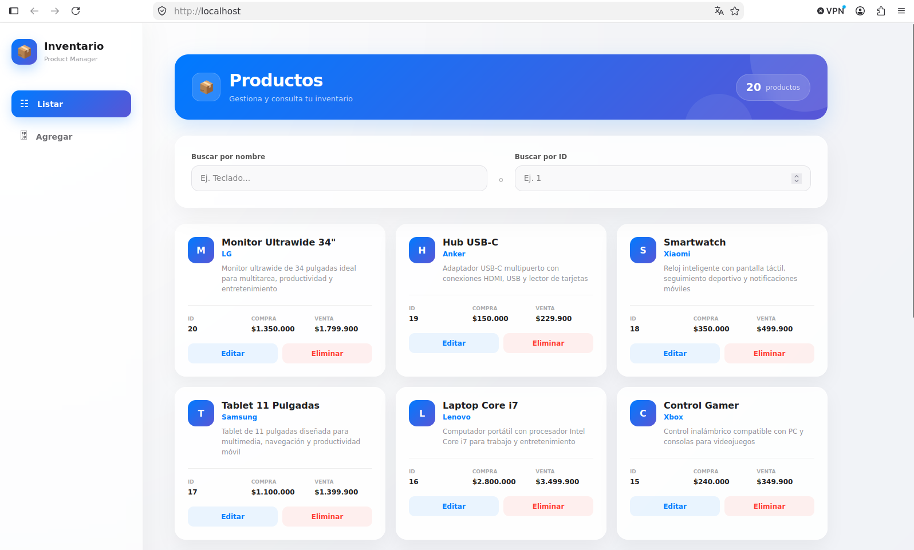
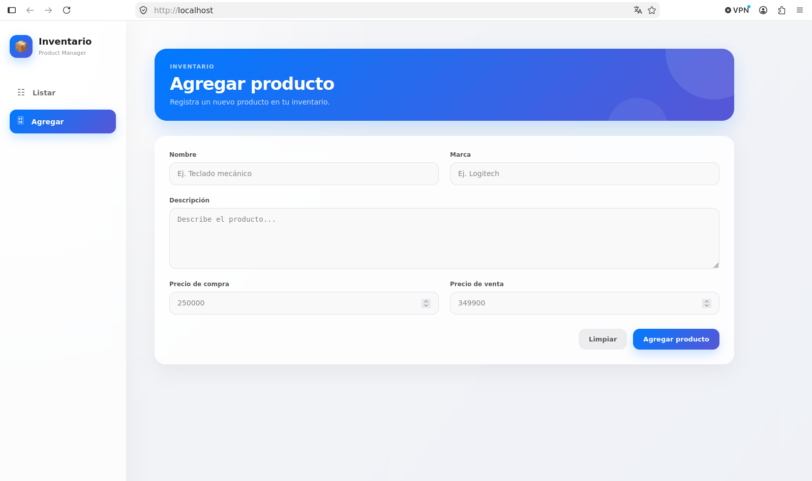
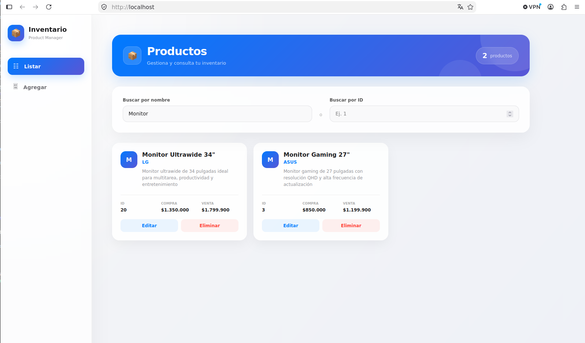
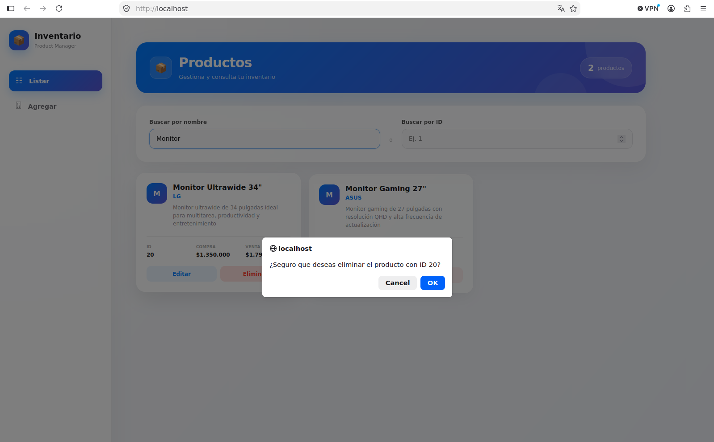
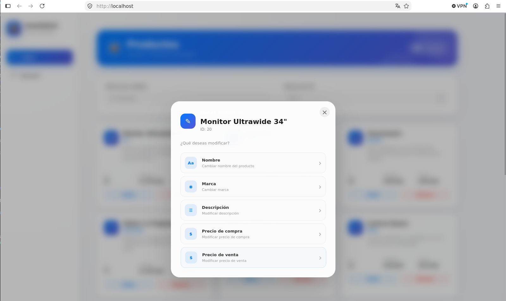
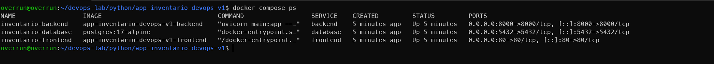

# Sistema de Inventario — Docker Compose

Aplicación de gestión de inventario desarrollada como un proyecto práctico de **contenedorización con Docker y Docker Compose**.

El proyecto permite administrar productos de un inventario mediante operaciones CRUD, utilizando una arquitectura compuesta por **Frontend, Backend y PostgreSQL**, cada uno ejecutándose en su propio contenedor.

Actualmente, el proyecto está orientado a ejecutarse completamente mediante **Docker Compose**.

<p align="center">
  
  
  
  
  
</p>

---

## 📋 Tabla de contenidos

* [Descripción](#-descripción)
* [Características](#-características)
* [Arquitectura](#-arquitectura)
* [Tecnologías utilizadas](#-tecnologías-utilizadas)
* [Estructura del proyecto](#-estructura-del-proyecto)
* [Base de datos](#-base-de-datos)
* [Configuración](#-configuración)
* [Configuración de variables de entorno](#-configuración-de-variables-de-entorno)
* [Ejecución con Docker Compose](#-ejecución-con-docker-compose)
* [Acceso a la aplicación](#-acceso-a-la-aplicación)
* [Operaciones disponibles](#-operaciones-disponibles)
* [Persistencia de datos](#-persistencia-de-datos)
* [Detener la aplicación](#-detener-la-aplicación)
* [Eliminar contenedores y datos](#-eliminar-contenedores-y-datos)
* [Comandos principales](#-comandos-principales)
* [Galería](#-galería)
* [Estado actual del proyecto](#-estado-actual-del-proyecto)
* [Autor](#-autor)
* [Licencia](#-licencia)

---

## 📌 Descripción

Este proyecto consiste en un sistema de inventario que permite gestionar productos almacenados en una base de datos PostgreSQL.

La aplicación está dividida en tres componentes principales:

* **Frontend:** interfaz gráfica para interactuar con el inventario.
* **Backend:** encargado de procesar las operaciones y comunicarse con PostgreSQL.
* **Database:** base de datos PostgreSQL donde se almacenan los productos.

Docker Compose permite levantar los tres servicios utilizando un único comando una vez configuradas las variables de entorno.

```text
                   ┌──────────────────────┐
                   │       Frontend       │
                   │      Puerto 80       │
                   └──────────┬───────────┘
                              │
                              ▼
                   ┌──────────────────────┐
                   │       Backend        │
                   │     Puerto 8000      │
                   └──────────┬───────────┘
                              │
                              ▼
                   ┌──────────────────────┐
                   │      PostgreSQL      │
                   │     Puerto 5432      │
                   └──────────────────────┘
```

---

## ✨ Características

El sistema permite realizar las siguientes operaciones:

* 📋 Listar todos los productos.
* ➕ Agregar nuevos productos.
* 🔎 Buscar productos por nombre.
* ✏️ Editar productos existentes.
* 🗑️ Eliminar productos.
* ⚠️ Confirmar la eliminación de un producto antes de realizarla.
* 💾 Persistir la información utilizando un volumen de Docker.
* 🐘 Utilizar PostgreSQL como sistema gestor de base de datos.
* 🐳 Ejecutar toda la aplicación mediante Docker Compose.
* 🚀 Levantar frontend, backend y base de datos de manera conjunta.

---

## 🏗️ Arquitectura

La aplicación utiliza una arquitectura basada en tres servicios independientes.

### Frontend

El frontend proporciona la interfaz con la que interactúa el usuario.

Se ejecuta mediante el contenedor:

```text
inventario-frontend
```

y está expuesto mediante:

```text
localhost:80
```

---

### Backend

El backend contiene la lógica de la aplicación y se comunica con la base de datos PostgreSQL.

Se ejecuta mediante el contenedor:

```text
inventario-backend
```

y está expuesto mediante:

```text
localhost:8000
```

Dentro de la red de Docker Compose, el backend se comunica con PostgreSQL utilizando el nombre del servicio:

```text
database
```

Por lo tanto, la conexión interna utiliza:

```text
database:5432
```

---

### PostgreSQL

La base de datos utiliza la imagen:

```text
postgres:17-alpine
```

El contenedor se llama:

```text
inventario-database
```

y utiliza un volumen de Docker para conservar los datos:

```text
postgres_data
```

---

## 🛠️ Tecnologías utilizadas

| Tecnología           | Uso                                |
| -------------------- | ---------------------------------- |
| Docker               | Contenedorización de la aplicación |
| Docker Compose       | Orquestación de los servicios      |
| PostgreSQL 17 Alpine | Base de datos                      |
| Python               | Backend                            |
| HTML                 | Estructura del frontend            |
| JavaScript           | Interactividad del frontend        |
| CSS                  | Estilos del frontend               |
| Git                  | Control de versiones               |
| GitHub               | Repositorio del proyecto           |

---

## 📁 Estructura del proyecto

La estructura principal del repositorio es:

```text
app-inventario-devops-v1/
│
├── backend/
│   ├── .env.example
│   ├── agregar.py
│   ├── buscar_id.py
│   ├── buscar_nombre.py
│   ├── conexion.py
│   ├── Dockerfile
│   ├── editar.py
│   ├── eliminar.py
│   ├── listar.py
│   ├── main.py
│   ├── models.py
│   └── requirements.txt
│
├── database/
│   └── init.sql
│
├── frontend/
│   ├── Dockerfile
│   ├── index.html
│   ├── main.js
│   └── styles.css
│
├── images/
│   ├── 01-image.png
│   ├── 02-image.png
│   ├── 03-image.png
│   ├── 04-image.png
│   ├── 05-image.png
│   └── 06-image.png
│
├── .gitignore
├── docker-compose.yaml
└── README.md
```

---

# 🗄️ Base de datos

La aplicación utiliza **PostgreSQL 17 Alpine**.

La base de datos utilizada por el proyecto es:

```text
inventario_db
```

La tabla principal es:

```text
productos
```

con los siguientes campos:

| Campo            | Tipo          | Descripción         |
| ---------------- | ------------- | ------------------- |
| `id`             | SERIAL        | Identificador único |
| `nombre`         | VARCHAR(100)  | Nombre del producto |
| `marca`          | VARCHAR(100)  | Marca del producto  |
| `descripcion`    | TEXT          | Descripción         |
| `precio_compra`  | NUMERIC(10,2) | Precio de compra    |
| `precio_venta`   | NUMERIC(10,2) | Precio de venta     |
| `fecha_creacion` | TIMESTAMP     | Fecha de creación   |

---

## 📦 Datos iniciales

El archivo:

```text
database/init.sql
```

se encarga de crear la tabla `productos` y cargar datos iniciales.

Actualmente se incluyen **20 productos de ejemplo**, entre ellos:

* Teclado Mecánico
* Mouse Gamer
* Monitor Gaming 27"
* Audífonos Inalámbricos
* SSD NVMe 1TB
* Memoria RAM 16GB
* Tarjeta Gráfica RTX 4060
* Procesador Ryzen 7
* Placa Base B650
* Fuente de Poder 750W
* Webcam Full HD
* Micrófono USB
* Router WiFi 6
* Disco Externo 2TB
* Control Gamer
* Laptop Core i7
* Tablet 11 Pulgadas
* Smartwatch
* Hub USB-C
* Monitor Ultrawide 34"

De esta manera, al levantar el proyecto por primera vez con un volumen nuevo, el inventario cuenta inicialmente con 20 productos.

---

# ⚙️ Configuración

## Requisitos

Para ejecutar el proyecto necesitas tener instalado:

* Docker
* Docker Compose
* Git

Puedes comprobar Docker con:

```bash
docker --version
```

Y Docker Compose con:

```bash
docker compose version
```

---

# 🔐 Configuración de variables de entorno

El archivo `.env` **no se encuentra dentro del repositorio**, ya que está incluido en `.gitignore`.

El repositorio proporciona un archivo:

```text
.env.example
```

que contiene las variables necesarias como referencia.

Después de clonar el proyecto, debes crear tu propio archivo `.env`.

### 1. Clonar el repositorio

```bash
git clone git@github.com:overrun1026/app-inventario-devops-v1.git
```

Entrar al proyecto:

```bash
cd app-inventario-devops-v1
```

### 2. Crear el archivo `.env`

Puedes copiar `.env.example`:

```bash
cp .env.example .env
```

### 3. Configurar las variables

Abre el archivo:

```text
.env
```

y configura los valores correspondientes.

Ejemplo:

```env
ENV_HOST=database
ENV_PORT=5432
ENV_DATABASE=inventario_db
ENV_USER=postgres
ENV_PASSWORD=123456
```

> El valor de `ENV_HOST` debe ser `database` cuando el backend se ejecuta dentro de Docker Compose, ya que `database` corresponde al nombre del servicio de PostgreSQL dentro de la red interna de Docker.

El archivo `.env` contiene información de configuración que no debe publicarse en el repositorio.

---

# 🐳 Ejecución con Docker Compose

Una vez creado y configurado el archivo `.env`, puedes construir las imágenes y levantar los servicios:

```bash
docker compose up -d --build
```

Docker Compose realizará las siguientes tareas:

1. Descargará la imagen de PostgreSQL.
2. Construirá la imagen del backend.
3. Construirá la imagen del frontend.
4. Creará la red interna de Docker Compose.
5. Creará el volumen `postgres_data`.
6. Iniciará PostgreSQL.
7. Iniciará el backend.
8. Iniciará el frontend.

---

## 🔍 Comprobar los contenedores

Para comprobar que los servicios están ejecutándose:

```bash
docker compose ps
```

Los servicios principales son:

```text
database
backend
frontend
```

También puedes comprobar todos los contenedores con:

```bash
docker ps
```

---

# 🌐 Acceso a la aplicación

Una vez que Docker Compose haya iniciado correctamente todos los servicios, abre en el navegador:

```text
http://localhost
```

El frontend está publicado mediante:

```text
80:80
```

Por lo tanto:

```text
http://localhost
```

permite acceder directamente a la aplicación.

El backend está expuesto en:

```text
http://localhost:8000
```

PostgreSQL está disponible en:

```text
localhost:5432
```

---

# 🖥️ Operaciones disponibles

## 📋 Listar productos

La aplicación permite visualizar los productos almacenados en la base de datos.

Al iniciar el proyecto por primera vez con una base de datos nueva se muestran los **20 productos iniciales** cargados desde `database/init.sql`.

---

## ➕ Agregar producto

La opción de agregar permite introducir la información de un nuevo producto mediante el formulario disponible en la aplicación.

Se pueden introducir datos como:

* Nombre
* Marca
* Descripción
* Precio de compra
* Precio de venta

---

## 🔎 Buscar producto

La aplicación permite buscar productos utilizando su nombre.

El usuario puede introducir el nombre en el campo de búsqueda para localizar un producto específico dentro del inventario.

---

## ✏️ Editar producto

La opción de editar permite modificar la información de un producto existente.

Al seleccionar esta opción se muestra un formulario con los campos disponibles para realizar los cambios.

---

## 🗑️ Eliminar producto

Antes de eliminar un producto, la aplicación muestra un mensaje de confirmación para evitar eliminaciones accidentales.

El usuario debe confirmar la operación antes de que el producto sea eliminado.

---

# 💾 Persistencia de datos

PostgreSQL utiliza un volumen de Docker llamado:

```text
postgres_data
```

El volumen permite conservar los datos de PostgreSQL aunque los contenedores sean eliminados.

Por ejemplo:

```bash
docker compose down
```

elimina los contenedores, pero mantiene el volumen y los datos.

---

## 🗃️ Inicialización de PostgreSQL

El archivo:

```text
database/init.sql
```

se monta dentro del contenedor PostgreSQL mediante:

```yaml
- ./database/init.sql:/docker-entrypoint-initdb.d/init.sql:ro
```

PostgreSQL ejecuta automáticamente los scripts colocados en:

```text
/docker-entrypoint-initdb.d/
```

durante la inicialización de una base de datos nueva.

### Importante

El `init.sql` se ejecuta durante la **creación inicial del volumen de PostgreSQL**.

Si el volumen `postgres_data` ya contiene una base de datos, modificar `init.sql` y volver a ejecutar:

```bash
docker compose up -d
```

no volverá a insertar automáticamente los productos iniciales.

Si necesitas comenzar nuevamente con una base de datos limpia puedes eliminar el volumen:

```bash
docker compose down -v
```

Y posteriormente:

```bash
docker compose up -d --build
```

> ⚠️ `docker compose down -v` elimina los datos almacenados en PostgreSQL.

---

# 🛑 Detener la aplicación

Para detener los contenedores:

```bash
docker compose down
```

Esto elimina los contenedores y la red creada por Compose, pero mantiene el volumen `postgres_data`.

Los datos de PostgreSQL permanecerán almacenados.

---

# 🗑️ Eliminar contenedores y datos

Si quieres eliminar completamente los contenedores y también los datos de PostgreSQL:

```bash
docker compose down -v
```

Después puedes reconstruir todo nuevamente:

```bash
docker compose up -d --build
```

Esto hará que PostgreSQL vuelva a inicializar la base de datos y cargue los productos definidos en `init.sql`.

---

# 🔒 Notas de seguridad

Las credenciales utilizadas actualmente corresponden a una configuración de desarrollo.

Para un entorno real o de producción se recomienda:

* Utilizar contraseñas fuertes.
* No almacenar credenciales directamente en el repositorio.
* Mantener `.env` fuera del control de versiones.
* Utilizar variables de entorno para la configuración sensible.
* Utilizar Docker Secrets u otro mecanismo de gestión de secretos en entornos de producción.
* No utilizar credenciales de desarrollo en ambientes productivos.

---

# 🚀 Comandos principales

### Construir y ejecutar

```bash
docker compose up -d --build
```

### Ver los servicios

```bash
docker compose ps
```

### Ver los logs

```bash
docker compose logs
```

### Ver logs del backend

```bash
docker compose logs backend
```

### Ver logs de PostgreSQL

```bash
docker compose logs database
```

### Ver logs del frontend

```bash
docker compose logs frontend
```

### Detener

```bash
docker compose down
```

### Detener y eliminar los datos

```bash
docker compose down -v
```

### Reconstruir las imágenes

```bash
docker compose build
```

---

# 📸 Galería

La siguiente galería muestra el funcionamiento de la aplicación y el entorno de Docker Compose.

## 1. Listado del inventario

La primera imagen muestra la aplicación ejecutándose en `localhost`.

En el apartado **Listar** se muestran los **20 productos iniciales** cargados desde la base de datos PostgreSQL.


---

## 2. Agregar producto

La segunda imagen muestra la opción **Agregar producto**.

La aplicación presenta un formulario con los diferentes campos disponibles para introducir la información de un nuevo producto.


---

## 3. Buscar producto por nombre

La tercera imagen muestra la funcionalidad de **búsqueda de productos**.

El usuario puede introducir el nombre del producto en el campo de búsqueda para localizar productos específicos dentro del inventario.


---

## 4. Confirmación de eliminación

La cuarta imagen muestra el mensaje de confirmación que aparece antes de eliminar un producto.

La aplicación solicita al usuario confirmar si está seguro de realizar la eliminación, evitando así eliminaciones accidentales.


---

## 5. Editar producto

La quinta imagen muestra la ventana que aparece al seleccionar la opción **Editar**.

El formulario contiene los diferentes campos del producto que pueden ser modificados.


---

## 6. Contenedores de Docker Compose

La sexta imagen muestra la ejecución del comando:

```bash
docker compose ps
```

En ella se pueden observar los servicios y contenedores creados para ejecutar la aplicación mediante Docker Compose.

Los principales servicios corresponden a:

* Frontend
* Backend
* PostgreSQL



---

# 📌 Estado actual del proyecto

Actualmente el proyecto se encuentra implementado utilizando:

```text
Docker Compose
├── Frontend
├── Backend
└── PostgreSQL
```

El objetivo actual es disponer de una aplicación completamente funcional y contenerizada mediante Docker Compose.

Como posibles etapas futuras se pueden incorporar:

* Kubernetes
* Minikube
* CI/CD
* GitHub Actions
* Terraform
* AWS
* Azure
* Gestión de secretos
* Monitoreo
* Logging centralizado

---

# 👨‍💻 Autor

**Overrun Games**

Proyecto desarrollado como parte de un proceso de aprendizaje y práctica de:

* Docker
* Docker Compose
* PostgreSQL
* Desarrollo Backend
* Desarrollo Frontend
* Git
* GitHub
* DevOps

---

# 📄 Licencia

Este proyecto se encuentra disponible para fines educativos y de aprendizaje.
